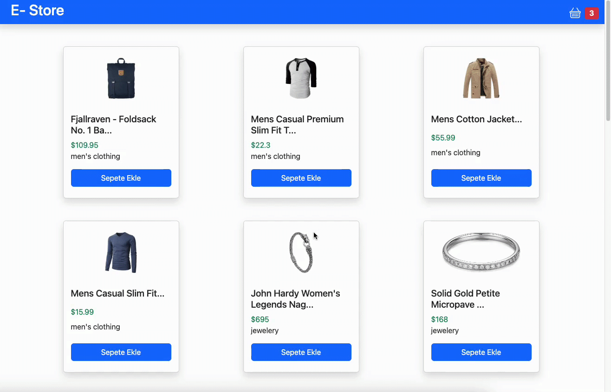

# React project Contect Apı

- Uygulamada birden çok bileşenin  ihtiyacı olan verileri bileşenlerden bağımsız bir şekilde 
konumlanan merkezlerde yönetmeye yarar.
- Verileri ve verileri değiştirmeye yarayan fonksiyonları tutar.
- Context tuttuğumuz bu değişkenleri herhangi bir bileşene doğrudan aktarabilir.
- Harici bir kütüphane değildir react içerisinde yer alır. orta ölçekli uygulamalar için idealdir
- Merkezi State Yönetim aracı

